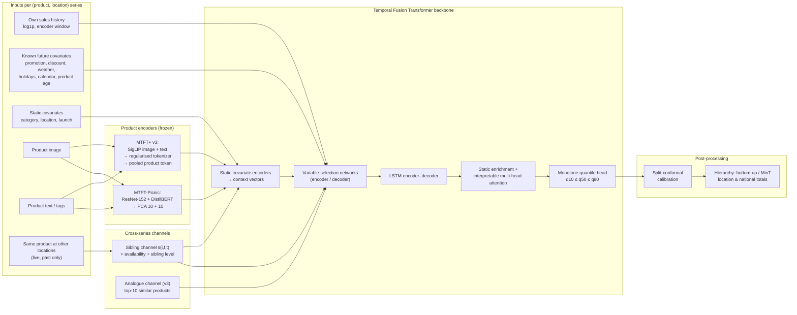

# Cross-Location Sibling Learning for Multimodal Product Demand Forecasting

**Author:** Om Prakash Bhardwaj

This repository extends the **Multimodal Temporal Fusion Transformer (MTFT)** of Sukel, Rudinac & Worring (*IEEE MultiMedia* 31(2), 2024) with **cross-location sibling learning**. Every (product, location) series also sees the recent demand of the *same product at its other locations*.

In a controlled, multi-seed study, this one addition is the largest and most consistent improvement we found to the MTFT design, on a synthetic grocery benchmark and on real retail data (VISUELLE 2.0). A richer multimodal stack (aligned SigLIP embeddings and analogue retrieval) adds little on top.

> **Scope.** "MTFT-Picnic" in this repository is our independent re-implementation of the published MTFT design: separately encoded image and text features, compressed to 10 dimensions each and used as static covariates. It is not Picnic's code, data or production system, and no claim is made about that system.
>
> The real-data evaluation uses VISUELLE 2.0 (fast fashion), because no public grocery dataset provides product images or text together with multi-location sales. The grocery claim is therefore a proof of concept: a grocery-like synthetic benchmark plus a public real-data benchmark in a neighbouring retail domain.

---

## Contents

1. [Key results](#1-key-results)
2. [Method](#2-method)
3. [Architecture](#3-architecture)
4. [Evaluation protocol](#4-evaluation-protocol)
5. [Detailed results](#5-detailed-results)
6. [What this means for a grocery retailer](#6-what-this-means-for-a-grocery-retailer)
7. [Reproducing the results](#7-reproducing-the-results)
8. [Repository layout](#8-repository-layout)
9. [Limitations](#9-limitations)
10. [Related repository, licence and citation](#10-related-repository-licence-and-citation)

---

## 1. Key results

All comparisons use identical data, splits, seeds, training budget and tuning effort. Intervals are paired product-cluster bootstrap 95 % intervals. "Seeds won" counts the training seeds on which the first model has the lower error.

| Setting | Metric | MTFT-Picnic | **MTFT-Picnic + siblings** | Difference [95 % CI] | Seeds won |
|---|---|---|---|---|---|
| Synthetic grocery benchmark (5 fulfilment centres × 1,000 products) | WAPE | 0.4126 | **0.4088** | −0.0038 | 3/3 |
| VISUELLE 2.0, calendar benchmark (shop-week, 4 test origins) | WAPE | 0.6515 | **0.6446** | **−0.0069 [−0.0084, −0.0054]** | 5/5 |
| VISUELLE 2.0, official SO-fore 2-1 (one-step) | WAPE % | 68.54 | **65.25** | **−3.29 [−3.52, −3.08]** | 5/5 |
| VISUELLE 2.0, official SO-fore 2-10 (multi-step) | WAPE % | 67.68 | **66.84** | **−0.85 [−1.24, −0.46]** | 5/5 |
| VISUELLE 2.0, new-product demand (no own history) | WAPE % | 64.46 | 64.01 | −0.44 [−0.92, +0.04] (n.s.) | 4/5 |

**Siblings help wherever the product has already sold somewhere.** The benefit disappears only when no location has sold the product yet, as in the pure new-product task.

**The multimodal increment is small and task-dependent.** MTFT+ v3 adds aligned SigLIP embeddings and analogue retrieval to the sibling model. Against MTFT-Picnic + siblings it gives:

| Setting | MTFT+ v3 − (MTFT-Picnic + siblings) | Seeds won |
|---|---|---|
| Calendar benchmark | −0.0012 [−0.0031, +0.0006], n.s. | 2/5 |
| SO-fore 2-1 | +0.48 (worse) | 1/5 |
| SO-fore 2-10 | −1.17 | 5/5 |
| New-product demand | −0.95 | 5/5 |

The product's appearance helps only when its own sales history is short or absent.

**About 85 % of v3's calendar-benchmark gain over MTFT-Picnic comes from siblings alone** (about 70 % on the synthetic benchmark).

**Reconciliation.** On short-lifecycle real data, summing bottom-level forecasts (bottom-up) is more accurate than MinT reconciliation at every level of the product × location hierarchy. On the synthetic grocery benchmark, MinT improves national totals.

---

## 2. Method

### 2.1 Backbone: MTFT

The Temporal Fusion Transformer (Lim et al., 2021) combines:
- static covariate encoders;
- variable-selection networks;
- an LSTM encoder–decoder;
- interpretable multi-head attention;
- quantile outputs.

The MTFT adds product image and text embeddings as static covariates. Our re-implementation (MTFT-Picnic) follows the published design: image and text are encoded separately, with ResNet-152 and DistilBERT on real data, and reduced to 10 principal components each.

### 2.2 Cross-location sibling channel

A product *i* sold at locations *f = 1…F* has *F* series with shared promotions, product appeal and life cycle. For target series (*i*, *f*) and every encoder step *t* before the forecast origin *t₀*:

$$
s_{i,f,t} \;=\; \frac{1}{|\mathcal{G}_{i,f,t}|}\sum_{g \in \mathcal{G}_{i,f,t}} \log\!\left(1 + y_{i,g,t}\right),
\qquad \mathcal{G}_{i,f,t} = \{\, g \neq f : (i,g) \text{ live at } t \,\}
$$

together with an availability flag and a static *sibling level* (the mean of *s* over the most recent steps).

- **Past only.** The channel is computed only from sales before *t₀*.
- **Own series excluded.** The series' own target never enters it.
- **Live locations only.** It averages only over locations where the product is stocked and observed.
- **Where it enters.** It enters the encoder variable-selection network as an observed input, and the sibling level enters as a static real.
- **Tested.** Unit tests check the value against a direct computation. They also corrupt every value from *t₀* onwards and assert that the features are unchanged.

**Why it works.** Averaging *F − 1* noisy sibling series gives a lower-variance estimate of the product's current demand level than the series' own short history. This matters most when a location has just started selling the product.

### 2.3 Full model (MTFT+ v3)

MTFT+ v3 feeds the TFT backbone with:
- frozen **SigLIP** image and text embeddings in one aligned space, passed through a **regularised tokenizer** (feature dropout, modality dropout) and pooled into a static product token;
- **analogue retrieval**: the demand of the 10 most similar products in embedding space, with the product itself excluded;
- the **sibling channel**.

The backbone ends in a **monotone quantile head** (q10 / q50 / q90, non-crossing by construction). After training:
- **split-conformal calibration** adjusts the interval quantiles;
- **hierarchical reconciliation** (bottom-up or MinT-shrink) makes the location and national totals coherent.

The full derivations are in [`docs/method.md`](docs/method.md).

---

## 3. Architecture



**Model variants in the study** (each ingredient is also added to the baseline as a control):

| Model | Product features | Siblings | Analogues |
|---|---|---|---|
| TFT | none | – | – |
| MTFT-Picnic | ResNet-152 + DistilBERT, PCA-10 each, static scalars | – | – |
| **MTFT-Picnic + siblings** (the key control) | as MTFT-Picnic | ✓ | – |
| MTFT+ v3 | SigLIP, regularised tokenizer, static pooled | ✓ | ✓ |

---

## 4. Evaluation protocol

- **Equal treatment.** Every model gets the same seeds, splits, windows, training budget (fixed epochs × batches) and early-stopping rule. All selection happens on validation data; nothing is tuned on test data.
- **Seeds.** The synthetic benchmark uses 3 data seeds. The real data uses 5 training seeds per model.
- **Uncertainty.** We use a paired product-cluster bootstrap (2,000 resamples, stratified by seed) plus per-seed win counts. The bootstrap captures product-sampling variance and the win counts capture training-run variance.
- **Metrics.**
  - WAPE and MASE on the median;
  - weighted quantile loss (wQL) over q10 / q50 / q90;
  - 80 % interval coverage;
  - subsets for cold-start products and for series new to their location.
- **Synthetic grocery benchmark.** A frozen generator: 5 fulfilment centres × 1,000 products × 540 days.
  - Negative-binomial demand, with centre-level weather, national and local promotions, holidays and category seasonality.
  - 20 % late launches, and 10 % cold-start products held out of training.
  - The generator was fixed before any model was compared, so it cannot favour a method.
- **VISUELLE 2.0** (Skenderi et al., CVPRW 2022). 5,355 fashion products in 110 shops, with an image and tags for each product, and 12 observed weeks per (product, shop). Launches are staggered: a median of 4 release dates per product.
  - *Calendar benchmark:* weekly grid; encoder 12, horizon 4; 4 validation and 4 test origins (test 2019-09-16 to 2019-12-30).
  - *Official protocol:* the dataset paper's short-observation tasks (SO-fore 2-1, 2-10) and its new-product demand task, with the official split and metric. Our Naive and SES re-runs reproduce the published numbers to within 0.1 WAPE point.

---

## 5. Detailed results

### 5.1 Synthetic grocery benchmark (3 seeds, product × fulfilment-centre level)

| Model | WAPE | Cold-start WAPE |
|---|---|---|
| TFT | 0.4163 | 0.4252 |
| MTFT-Picnic | 0.4126 | 0.4244 |
| **MTFT-Picnic + siblings** | **0.4088** | **0.4163** |
| MTFT+ v3 | 0.4072 | 0.4145 |

Against MTFT-Picnic, v3's gain is −0.0055 [−0.0064, −0.0047] WAPE. Siblings alone recover about 70 % of it overall and about 84 % on cold starts. Full tables: [`results/results.md`](results/results.md). Earlier versions (v1, v2) and why they failed: [`results/v1`](results/v1/README_v1.md), [`results/v2`](results/v2/README_v2.md).

### 5.2 VISUELLE 2.0, calendar benchmark (5 seeds, shop-week level)

| Model | WAPE | wQL | Cold-start WAPE | New-in-shop WAPE |
|---|---|---|---|---|
| TFT | 0.6547 | 0.4227 | 0.6457 | 0.6926 |
| MTFT-Picnic | 0.6515 | 0.4197 | 0.6420 | 0.6954 |
| **MTFT-Picnic + siblings** | **0.6446** | **0.4145** | **0.6349** | **0.6816** |
| MTFT+ v3 | 0.6434 | 0.4140 | 0.6344 | 0.6792 |
| Chronos-2 (zero-shot foundation model) | 1.0252 | 0.7118 | 0.9904 | 1.1657 |

Absolute WAPE is high because targets are small weekly counts: about 1.1 units per live cell, 37 % of them zeros. Relative differences are what the benchmark measures.

### 5.3 VISUELLE 2.0, official protocol (WAPE %, 5 seeds)

| Model | SO-fore 2-1 | SO-fore 2-10 | Demand |
|---|---|---|---|
| Naive / SES (our re-run; matches the paper) | 101.93 / 97.86 | 118.24 / 111.34 | – |
| TFT | 68.07 | 67.61 | 65.00 |
| MTFT-Picnic | 68.54 | 67.68 | 64.46 |
| **MTFT-Picnic + siblings** | **65.25** | 66.84 | 64.01 |
| MTFT+ v3 | 65.73 | **65.66** | **63.07** |

Tables with all bootstrap intervals: [`results_visuelle2/results.md`](results_visuelle2/results.md) (calendar) and [`results_visuelle2_official/results.md`](results_visuelle2_official/results.md) (official). The full write-up is [`results/visuelle2/README.md`](results/visuelle2/README.md).

### 5.4 Hierarchy (VISUELLE 2.0, MTFT+ v3, WAPE)

| Method | National | Shop | Product (all shops) |
|---|---|---|---|
| **Bottom-up** | **0.0988** | **0.1549** | **0.3241** |
| MinT-WLS | 0.1157 | 0.1942 | 0.3918 |
| MinT-shrink | 3.04 (fails) | 3.04 | 0.6010 |

MinT-shrink fails here because its covariance is estimated from series that are mostly no longer on sale by the test period: life cycles are 12 weeks. Bottom-up is recommended for short-lifecycle assortments.

---

## 6. What this means for a grocery retailer

- **Drop-in.** The sibling channel is two extra inputs per series: the product's mean log demand at its other locations over the encoder window, and its recent level. It needs no images, no new model architecture and no retraining of encoders. It helped the published MTFT design on every seed of every setting in which the product had sales at another location.
- **When it helps most.**
  - Series that are new to a location while the product already sells elsewhere: new-in-shop WAPE falls from 0.6954 to 0.6816.
  - One-step forecasts, where the siblings' current level is the most informative signal.
- **When it does not help.** A product that no location has sold yet has no siblings to learn from. There, product content (images and text) and similar products are the only information.
- **Operational cost.** The channel is computed from the same sales table. Cost is linear in the number of locations per product.
- **Totals.** For location and national totals of short-lifecycle products, sum the bottom-level forecasts. For long-lived assortments with stable cross-series correlations, MinT reconciliation can help national totals, as it does on the synthetic grocery benchmark.

---

## 7. Reproducing the results

### 7.1 Installation

```bash
python -m venv .venv && source .venv/bin/activate      # Windows: .venv\Scripts\activate
pip install torch --index-url https://download.pytorch.org/whl/cu124   # or the CPU wheel
pip install -e ".[multimodal,baselines,dev]"
pytest -q tests                                          # 25 tests
```

### 7.2 Synthetic grocery benchmark (no external data)

```bash
python benchmark.py --no-ablations --accelerator gpu     # 3 data seeds × all models (resumable)
python report.py --out results --ours "MTFT+ v3 (ours)"
```

### 7.3 VISUELLE 2.0

The dataset is distributed by its authors on request: see <https://humaticslab.github.io/forecasting/visuelle>. It is **not** included here. Place it in `visuelle2/`, then run:

```bash
python examples/convert_visuelle2.py --src visuelle2 --out data/visuelle2_converted
python examples/convert_visuelle2.py --src visuelle2 --out data/visuelle2_converted_full --end 2020-03-16
python examples/unimodal_features.py --data-dir data/visuelle2_converted \
       --image-model microsoft/resnet-152 --text-model distilbert-base-uncased
cp data/visuelle2_converted/unimodal_*.npy data/visuelle2_converted_full/
python examples/prepare_panel.py --data-dir data/visuelle2_converted --freq W-MON \
       --model-name google/siglip-base-patch16-224 --out panel_v2.pkl
python examples/prepare_panel.py --data-dir data/visuelle2_converted_full --freq W-MON \
       --embeddings panel_v2.embeddings.pt --out panel_v2_full.pkl

# calendar benchmark
python benchmark.py --panel panel_v2.pkl --seeds 1,2,3,4,5 --no-ablations --no-quotas --epochs 16 --batches-per-epoch 200 \
       --models "TFT,MTFT-Picnic,MTFT-Picnic + siblings,MTFT+ v3 (ours)" --out results_visuelle2
python report.py --out results_visuelle2 --ours "MTFT+ v3 (ours)" \
       --extra-pairs "MTFT-Picnic + siblings|MTFT-Picnic,MTFT-Picnic|TFT,MTFT+ v3 (ours)|MTFT-Picnic + siblings"

# official protocol
python examples/visuelle2_official.py --panel panel_v2_full.pkl --src visuelle2 --seeds 1,2,3,4,5 \
       --epochs 16 --batches-per-epoch 200 --out results_visuelle2_official
python examples/visuelle2_official.py --report --out results_visuelle2_official

# zero-shot Chronos-2
python examples/chronos2_baseline.py calendar --panel panel_v2.pkl --out results_visuelle2
python examples/chronos2_baseline.py official --panel panel_v2_full.pkl --out results_visuelle2_official
```

The published numbers were produced on one NVIDIA RTX 2060 SUPER (8 GB) in fp32. Run training jobs one at a time.

**What is and is not included.**
- **Included:** aggregate results (metrics per model and seed). Synthetic per-run files are also included.
- **Not included:** per-run result files for VISUELLE 2.0. They contain per-product sales derived from the dataset, which is not ours to redistribute. The commands above regenerate them.

---

## 8. Repository layout

```
mtft_plus/                 the library
  model.py                 MTFT backbone; fusion modes none / static_scalar / static_pooled / cross_attention
  layers.py                GRN, GLU, vectorised variable-selection network, interpretable attention, monotone quantile head
  features.py              SigLIP / OpenCLIP extractor with cache; regularised multimodal tokenizer; alignment loss
  data.py                  synthetic generator (frozen); window dataset with sibling and analogue channels
  panel.py                 real-data adapter (long-format CSVs, daily or weekly grids, live masks)
  reconciliation.py        hierarchy, sparse MinT-shrink / WLS, seasonal ridge base model
  calibration.py           split-conformal quantile calibration
  lightning_module.py      training loop (AdamW + OneCycle, quantile loss)
  metrics.py, losses.py    WAPE, MASE, wQL, coverage; pinball loss
  lifecycle.py             later extension (lifecycle-aligned features), see the complete repository
benchmark.py               multi-seed, equal-budget benchmark (synthetic or --panel real data)
report.py                  tables, paired bootstrap, per-seed wins
examples/                  VISUELLE 2.0 conversion, feature extraction, official protocol, Chronos-2 baseline
tests/                     25 unit tests (causality of every feature, sibling correctness, MinT vs closed form, ...)
results/                   synthetic results, v1/v2 history, VISUELLE 2.0 write-up
results_visuelle2*/        VISUELLE 2.0 aggregate tables
docs/method.md             full mathematical description and design history (v1 → v3)
```

---

## 9. Limitations

- **Data.** No Picnic data and no real grocery data with product images were available. Real-data evidence comes from fashion retail (VISUELLE 2.0); grocery evidence comes from a synthetic benchmark. The complete repository adds an evaluation on M5 (Walmart), including its FOODS category.
- **Absolute accuracy.** Shop-week targets are small counts, so absolute WAPE is dominated by count noise. The comparisons are relative and paired.
- **Uncertainty.** The bootstrap resamples products, not training runs. Per-seed win counts are reported with every interval for that reason.
- **Chronos-2 comparison.** Zero-shot only here. The complete repository reports fully fine-tuned Chronos-2 with covariates and group attention.

---

## 10. Related repository, licence and citation

- **Complete research repository** (all versions v1–v4, the lifecycle-aligned extension, M5, re-runs of published baselines, pre-registration and paper draft): <https://github.com/ombdj1209/mtft-plus>.
- **Licence:** MIT (see [`LICENSE`](LICENSE)). The VISUELLE 2.0 dataset and the pretrained encoders keep their own licences and terms.

**Please cite:**

```bibtex
@software{bhardwaj2026siblings,
  author = {Bhardwaj, Om Prakash},
  title  = {Cross-Location Sibling Learning for Multimodal Product Demand Forecasting},
  year   = {2026},
  url    = {https://github.com/ombdj1209/mtft-cross-location-siblings}
}
```

**Works this builds on:**
- Sukel, M., Rudinac, S., & Worring, M. (2024). Multimodal temporal fusion transformers are good product demand forecasters. *IEEE MultiMedia, 31*(2), 48–60. https://doi.org/10.1109/MMUL.2024.3373827
- Lim, B., Arık, S. Ö., Loeff, N., & Pfister, T. (2021). Temporal fusion transformers for interpretable multi-horizon time series forecasting. *International Journal of Forecasting, 37*(4), 1748–1764.
- Skenderi, G., Joppi, C., Denitto, M., Scarpa, B., & Cristani, M. (2022). The multi-modal universe of fast-fashion: The Visuelle 2.0 benchmark. *CVPR Workshops*, 2240–2245.
- Ansari, A. F., et al. (2025). Chronos-2: From univariate to universal forecasting. arXiv:2510.15821.
- Wickramasuriya, S. L., Athanasopoulos, G., & Hyndman, R. J. (2019). Optimal forecast reconciliation for hierarchical and grouped time series through trace minimization. *JASA, 114*(526), 804–819.
